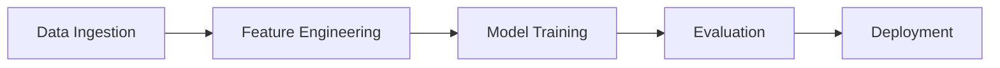

## Welcome

This is the first post on my personal blog. I'll be writing about:

- **Machine Learning at Scale** — lessons from building production ML systems at Walmart
- **Research Insights** — deep dives into papers and methods
- **Data Science Leadership** — managing DS teams and strategy

### Code Example

Here's a quick Python snippet to show syntax highlighting:

```python
import numpy as np

def sigmoid(x):
    return 1 / (1 + np.exp(-x))
```

### Math Example

Inline math: $$E = mc^2$$

Display math:

$$
\mathcal{L}(\theta) = -\sum_{i=1}^{N} \left[ y_i \log(h_\theta(x_i)) + (1-y_i) \log(1-h_\theta(x_i)) \right]
$$

### Mermaid Diagram



More posts coming soon!
