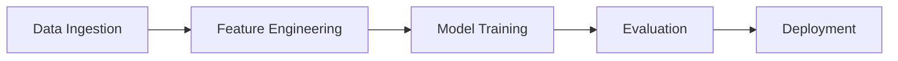

# Personal Website Implementation Plan

> **For agentic workers:** REQUIRED: Use superpowers:subagent-driven-development (if subagents available) or superpowers:executing-plans to implement this plan. Steps use checkbox (`- [ ]`) syntax for tracking.

**Goal:** Build and deploy a personal academic/industry website for Hari Prasad Piridi using al-folio Jekyll theme on GitHub Pages.

**Architecture:** Fork al-folio, customize configuration and content, add a custom patents page, deploy via GitHub Actions to `hpiridi.github.io`.

**Tech Stack:** Jekyll, al-folio theme, Docker (local dev), GitHub Pages + Actions (deployment), Liquid templates, BibTeX (publications)

**Spec:** `docs/superpowers/specs/2026-03-10-personal-website-design.md`

---

## Chunk 1: Repository Setup & Core Configuration

### Task 1: Fork and Clone al-folio

**Files:**
- None (GitHub + git operations)

- [ ] **Step 1: Fork al-folio on GitHub**

```bash
gh repo fork alshedivat/al-folio --clone=false --fork-name hpiridi.github.io
```
Expected: Repository created at `github.com/hpiridi/hpiridi.github.io`. If `--fork-name` creates it as `al-folio` instead, rename:
```bash
gh repo rename hpiridi.github.io --repo hpiridi/al-folio
```

- [ ] **Step 2: Enable GitHub Actions**

```bash
gh api -X PUT repos/hpiridi/hpiridi.github.io/actions/permissions -f enabled=true -f allowed_actions=all
```

- [ ] **Step 3: Set Actions workflow permissions to read-write**

```bash
gh api -X PUT repos/hpiridi/hpiridi.github.io/actions/permissions/workflow -f default_workflow_permissions=write -f can_approve_pull_request_reviews=true
```

- [ ] **Step 4: Clone the repo locally**

```bash
cd /Users/h0p04i89/SourceCode/ResearchProjects/JekyllWebsite
git clone git@github.com:hpiridi/hpiridi.github.io.git .
```
Expected: al-folio files now in the JekyllWebsite directory

- [ ] **Step 5: Verify Docker setup works**

```bash
docker compose up -d
```
Expected: Site accessible at `http://localhost:8080` with live reload. Verify by opening in browser.

- [ ] **Step 6: Verify clean state**

```bash
git status
```
Expected: Clean working tree, on `main` branch

---

### Task 2: Configure `_config.yml` — All Site Settings

**Files:**
- Modify: `_config.yml`

- [ ] **Step 1: Read the existing `_config.yml` to understand the current structure**

Read the full file. Identify all sections and their current values.

- [ ] **Step 2: Update site identity settings**

```yaml
first_name: Hari Prasad
middle_name:
last_name: Piridi
email: PLACEHOLDER@email.com
description: >
  Director, Data Science @ Walmart | Research Scholar
url: https://hpiridi.github.io
baseurl: ""
blog_name: "Hari Prasad Piridi"
```

- [ ] **Step 3: Update theme and display settings**

```yaml
enable_darkmode: true
enable_math: true
```
`enable_darkmode: true` enables auto light/dark mode with system preference detection plus manual toggle.

- [ ] **Step 4: Configure latest_posts (site-level)**

```yaml
latest_posts:
  enabled: true
  scrollable: true
  limit: 3
```

- [ ] **Step 5: Configure imagemagick**

```yaml
imagemagick:
  enabled: true
```

- [ ] **Step 6: Configure scholar settings for author highlighting**

Find the existing `scholar:` section and update:
```yaml
scholar:
  last_name: [Piridi]
  first_name: [Hari Prasad, H.P.]
```
Keep other scholar defaults (style, locale, source, bibliography, bibliography_template).

- [ ] **Step 7: Configure social links**

Social links are individual keys in `_config.yml`. Find and update:
```yaml
github_username: hpiridi
linkedin_username: PLACEHOLDER
x_username: PLACEHOLDER
scholar_userid: PLACEHOLDER
orcid_id: PLACEHOLDER
research_gate_profile: PLACEHOLDER
semanticscholar_id: PLACEHOLDER
```

- [ ] **Step 8: Add Giscus comments placeholder config**

```yaml
giscus:
  repo: hpiridi/hpiridi.github.io
  repo_id: PLACEHOLDER
  category: Announcements
  category_id: PLACEHOLDER
  mapping: pathname
  strict: 0
  reactions_enabled: 1
  emit_metadata: 0
  input_position: bottom
  theme: preferred_color_scheme
  lang: en
```
Note: User must visit [giscus.app](https://giscus.app/) to get `repo_id` and `category_id` values.

- [ ] **Step 9: Register `_teachings` collection**

Find the `collections:` section and add:
```yaml
collections:
  news:
    defaults:
      layout: post
  projects:
    output: true
    permalink: /projects/:path/
  teachings:
    output: true
    permalink: /teaching/:path/
```
Keep existing `news` and `projects` entries; add `teachings`.

- [ ] **Step 10: Verify locally**

```bash
docker compose up -d
```
Open `http://localhost:8080`. Check that the site title shows "Hari Prasad Piridi", dark mode toggle works, and social icons appear.

- [ ] **Step 11: Commit**

```bash
git add _config.yml
git commit -m "Configure site identity, theme, social links, scholar, giscus, and collections"
```

---

## Chunk 2: Content Pages — About, Publications, Patents, Blog

### Task 3: Set Up About Page

**Files:**
- Modify: `_pages/about.md`
- Create: `assets/img/prof_pic.jpg` (placeholder)
- Modify: `_news/` directory

- [ ] **Step 1: Read the existing `_pages/about.md`**

Understand front matter and content structure. Also check if `about_einstein.md` exists — it should be removed or disabled.

- [ ] **Step 2: Remove `about_einstein.md` if it exists**

```bash
rm -f _pages/about_einstein.md
```

- [ ] **Step 3: Update About page content**

Edit `_pages/about.md`:
```yaml
---
layout: about
title: about
permalink: /
subtitle: Director, Data Science @ <a href='https://www.walmart.com'>Walmart</a> | Research Scholar

profile:
  align: right
  image: prof_pic.jpg
  image_circular: false
  more_info: >
    <p>Bentonville, AR</p>

selected_papers: true
news: true
social: true
---

Hari Prasad Piridi is a Director of Data Science at Walmart, where he leads teams building large-scale machine learning systems. He is also an active Research Scholar with publications in top-tier venues and patents in applied ML.

Replace this bio with your actual professional summary.
```
Note: Do NOT put `latest_posts` in page front matter — it is a site-level config in `_config.yml` (already set in Task 2).

- [ ] **Step 4: Add a placeholder profile image**

The user will replace `assets/img/prof_pic.jpg` with their actual headshot. For now, leave the existing al-folio sample image or note to replace.

- [ ] **Step 5: Update news items**

Read existing `_news/` files. Clear sample news and add:

Write `_news/announcement_1.md`:
```yaml
---
layout: post
date: 2026-03-10
inline: true
related_posts: false
---

Welcome to my personal website! More updates coming soon.
```

Remove other sample news files.

- [ ] **Step 6: Verify About page**

Open `http://localhost:8080`. Check: profile section, bio text, social icons, news timeline, latest posts section.

- [ ] **Step 7: Commit**

```bash
git add _pages/about.md _news/ assets/img/
git commit -m "Set up About page with bio, profile, and news"
```

---

### Task 4: Set Up Publications Page

**Files:**
- Modify: `_bibliography/papers.bib`
- Verify: `_pages/publications.md` exists

- [ ] **Step 1: Read existing `_bibliography/papers.bib` and `_pages/publications.md`**

Understand current sample entries and page front matter (confirm `nav: true` and note `nav_order`).

- [ ] **Step 2: Set `nav_order: 1` in `_pages/publications.md` front matter**

- [ ] **Step 3: Replace sample BibTeX with placeholder entries**

Edit `_bibliography/papers.bib` — clear sample entries and add:
```bibtex
@inproceedings{piridi2025placeholder1,
  title     = {Sample Paper Title — Replace with Your Publication},
  author    = {Piridi, Hari Prasad and Coauthor, Name},
  booktitle = {Conference Name (e.g., NeurIPS, KDD, ICML)},
  year      = {2025},
  selected  = {true},
  abstract  = {Replace with your paper abstract.},
  pdf       = {https://example.com/paper.pdf},
  preview   = {wave-mechanics.gif}
}

@article{piridi2024placeholder2,
  title     = {Another Sample Paper — Replace with Your Publication},
  author    = {Piridi, Hari Prasad and Coauthor, Another},
  journal   = {Journal Name (e.g., IEEE TPAMI, JMLR)},
  year      = {2024},
  selected  = {false},
  abstract  = {Replace with your paper abstract.}
}
```

- [ ] **Step 4: Verify publications page**

Open `http://localhost:8080/publications/`. Check: entries render with title, authors (Piridi bolded), year, abstract toggle.

- [ ] **Step 5: Commit**

```bash
git add _bibliography/papers.bib _pages/publications.md
git commit -m "Add placeholder publication entries"
```

---

### Task 5: Create Custom Patents Page

**Files:**
- Create: `_data/patents.yml`
- Create: `_pages/patents.md`

al-folio has no built-in patents page — this is fully custom.

- [ ] **Step 1: Create patents data file**

Write `_data/patents.yml`:
```yaml
- title: "Sample Patent Title — Replace with Your Patent"
  number: "US-XX,XXX,XXX"
  status: granted
  date_filed: 2023-01-15
  date_granted: 2025-06-15
  inventors:
    - Hari Prasad Piridi
    - Co-Inventor Name
  abstract: "Replace with patent abstract. A system and method for..."
  link: "https://patents.google.com/patent/USXXXXXXXX"

- title: "Another Sample Patent — Replace with Your Patent"
  number: "US-XXXX/XXXXXXX"
  status: pending
  date_filed: 2024-06-01
  date_granted:
  inventors:
    - Hari Prasad Piridi
  abstract: "Replace with patent abstract."
  link: ""
```

- [ ] **Step 2: Create patents page with Liquid template**

Write `_pages/patents.md`:
```markdown
---
layout: page
permalink: /patents/
title: patents
description: Granted and pending patents.
nav: true
nav_order: 2
---

<div class="patents">

<div class="patent-entry" style="margin-bottom: 2rem; padding-bottom: 1.5rem; border-bottom: 1px solid var(--global-divider-color);">
  <h3 style="margin-bottom: 0.3rem;">{{ patent.title }}</h3>
  <div style="margin-bottom: 0.5rem;">
    <span class="badge" style="
      background-color: #28a745#ffc107#6c757d;
      color: #333#fff;
      padding: 2px 8px;
      border-radius: 4px;
      font-size: 0.8rem;
      text-transform: uppercase;
    ">{{ patent.status }}</span>
    <span style="margin-left: 0.5rem; font-family: monospace;">{{ patent.number }}</span>
  </div>
  <div style="font-size: 0.9rem; color: var(--global-text-color-light); margin-bottom: 0.3rem;">
    <strong>Inventors:</strong> {{ patent.inventors | join: ", " }}
  </div>
  
  <div style="font-size: 0.85rem; color: var(--global-text-color-light);">
    <strong>Filed:</strong> {{ patent.date_filed }} &middot; <strong>Granted:</strong> {{ patent.date_granted }}
  </div>
  
  <div style="font-size: 0.85rem; color: var(--global-text-color-light);">
    <strong>Filed:</strong> {{ patent.date_filed }}
  </div>
  
  
  <details style="margin-top: 0.5rem;">
    <summary style="cursor: pointer; font-size: 0.9rem; color: var(--global-theme-color);">Abstract</summary>
    <p style="margin-top: 0.5rem; font-size: 0.9rem;">{{ patent.abstract }}</p>
  </details>
  
  
  <a href="{{ patent.link }}" target="_blank" rel="noopener noreferrer" style="font-size: 0.9rem;">View Patent &rarr;</a>
  
</div>

</div>
```

- [ ] **Step 3: Verify patents page**

Open `http://localhost:8080/patents/`. Check: entries render with title, status badge (green for granted, yellow for pending), inventors, dates, expandable abstract, external link.

- [ ] **Step 4: Commit**

```bash
git add _data/patents.yml _pages/patents.md
git commit -m "Add custom patents page with YAML data and Liquid template"
```

---

### Task 6: Set Up Blog with Sample Post

**Files:**
- Remove: existing sample posts in `_posts/`
- Create: `_posts/2026-03-10-welcome.md`

- [ ] **Step 1: Read existing `_posts/` directory**

List all sample posts that shipped with al-folio.

- [ ] **Step 2: Remove al-folio sample posts**

```bash
rm _posts/*
```

- [ ] **Step 3: Set `nav_order: 4` in `_pages/blog.md` front matter**

Read `_pages/blog.md` and update its `nav_order`.

- [ ] **Step 4: Create a starter blog post**

Write `_posts/2026-03-10-welcome.md`:
```markdown
---
layout: post
title: Welcome to My Blog
date: 2026-03-10
description: First post — what to expect from this blog.
tags: [welcome, data-science]
categories: [general]
giscus_comments: true
related_posts: false
mermaid: true
toc:
  sidebar: left
---

## Welcome

This is the first post on my personal blog. I'll be writing about:

- **Machine Learning at Scale** — lessons from building production ML systems at Walmart
- **Research Insights** — deep dives into papers and methods
- **Data Science Leadership** — managing DS teams and strategy

### Code Example

Here's a quick Python snippet to show syntax highlighting:

```python
import numpy as np

def sigmoid(x):
    return 1 / (1 + np.exp(-x))
```

### Math Example

Inline math: $$E = mc^2$$

Display math:

$$
\mathcal{L}(\theta) = -\sum_{i=1}^{N} \left[ y_i \log(h_\theta(x_i)) + (1-y_i) \log(1-h_\theta(x_i)) \right]
$$

### Mermaid Diagram



More posts coming soon!
```

- [ ] **Step 5: Verify blog page and post**

Open `http://localhost:8080/blog/`. Check: post appears in list. Click through — verify code highlighting, math rendering, mermaid diagram, TOC sidebar.

- [ ] **Step 6: Commit**

```bash
git add _posts/ _pages/blog.md
git commit -m "Replace sample posts with starter welcome post"
```

---

## Chunk 3: CV, Teaching, Projects & Cleanup

### Task 7: Set Up CV Page

**Files:**
- Modify: `_pages/cv.md`
- Modify: `_data/cv.yml`
- Create: `assets/pdf/cv.pdf` (placeholder)

- [ ] **Step 1: Read existing `_pages/cv.md` and `_data/cv.yml`**

Understand the actual al-folio CV YAML schema. al-folio uses a custom format with section `type` values: `map`, `time_table`, `nested_list`, `list`. Note the structure carefully.

- [ ] **Step 2: Update `_pages/cv.md` front matter**

```yaml
---
layout: cv
permalink: /cv/
title: cv
nav: true
nav_order: 6
cv_pdf: cv.pdf
description:
---
```

- [ ] **Step 3: Update `_data/cv.yml` with placeholder content**

Follow al-folio's actual schema. Example structure:
```yaml
- title: General Information
  type: map
  contents:
    - name: Full Name
      value: Hari Prasad Piridi
    - name: Location
      value: Bentonville, AR
    - name: Email
      value: PLACEHOLDER@email.com

- title: Experience
  type: time_table
  contents:
    - title: Director, Data Science
      institution: Walmart
      year: YYYY - Present
      description:
        - Leading data science teams building large-scale ML systems
        - Replace with your actual experience highlights

- title: Education
  type: time_table
  contents:
    - title: "PhD/MS/BS in Your Field"
      institution: Your University
      year: YYYY - YYYY
      description:
        - Replace with your education details

- title: Skills
  type: nested_list
  contents:
    - title: Machine Learning
      items:
        - Deep Learning, NLP, Recommender Systems, Time Series
    - title: Programming
      items:
        - Python, SQL, Spark, TensorFlow, PyTorch
    - title: Infrastructure
      items:
        - Kubernetes, Airflow, MLflow, Cloud (GCP/Azure)

- title: Honors & Awards
  type: list
  contents:
    - Replace with your honors and awards
```
Important: Match the actual schema from the existing `_data/cv.yml`. Read it first and follow its exact format.

- [ ] **Step 4: Add placeholder CV PDF**

Copy or create a placeholder at `assets/pdf/cv.pdf`. Remove the default `assets/pdf/example_pdf.pdf` if it exists:
```bash
rm -f assets/pdf/example_pdf.pdf
echo "Replace this file with your actual CV PDF" > assets/pdf/cv.pdf
```

- [ ] **Step 5: Verify CV page**

Open `http://localhost:8080/cv/`. Check: sections render correctly, PDF download link works.

- [ ] **Step 6: Commit**

```bash
git add _pages/cv.md _data/cv.yml assets/pdf/
git commit -m "Set up CV page with placeholder data"
```

---

### Task 8: Set Up Teaching Page

**Files:**
- Modify: `_pages/teaching.md`
- Create: `_teachings/sample-course.md`

Note: The `_teachings` collection was registered in `_config.yml` in Task 2, Step 9.

- [ ] **Step 1: Read existing `_pages/teaching.md`**

Check current content and front matter.

- [ ] **Step 2: Update teaching page with Liquid template**

The default teaching page is static markdown. Since we registered a `_teachings` collection, we need a Liquid loop to render entries. Edit `_pages/teaching.md`:

```markdown
---
layout: page
permalink: /teaching/
title: teaching
description: Courses, workshops, and mentoring.
nav: true
nav_order: 5
---


<div style="margin-bottom: 2rem;">
  <h3>
    
      <a href="{{ teaching.url | relative_url }}">{{ teaching.title }}</a>
    
      {{ teaching.title }}
    
  </h3>
  <p style="font-size: 0.9rem; color: var(--global-text-color-light);">{{ teaching.year }} · {{ teaching.institution }}</p>
  <p>{{ teaching.description }}</p>
</div>

```

- [ ] **Step 3: Add sample teaching entry**

Write `_teachings/sample-course.md`:
```yaml
---
layout: page
title: "Sample Course — Replace with Your Course"
description: "Course description here"
year: 2025
institution: "Your Institution"
importance: 1
category: course
---

Replace this with details about your course, workshop, or guest lecture.

### Topics Covered
- Topic 1
- Topic 2
```

- [ ] **Step 4: Verify teaching page**

Open `http://localhost:8080/teaching/`. Check that teaching entries render with title, year, institution.

- [ ] **Step 5: Commit**

```bash
git add _pages/teaching.md _teachings/
git commit -m "Set up teaching page with collection template and sample entry"
```

---

### Task 9: Set Up Projects Page

**Files:**
- Modify: `_pages/projects.md`
- Remove: existing sample projects in `_projects/`
- Create: `_projects/demand-forecasting.md`, `_projects/research-project.md`

- [ ] **Step 1: Read existing `_pages/projects.md` and `_projects/` directory**

Note the `display_categories` in `_pages/projects.md` front matter — this controls category grouping.

- [ ] **Step 2: Update `_pages/projects.md` front matter**

Set `nav_order: 3` and update `display_categories` to match our project categories:
```yaml
---
layout: page
title: projects
permalink: /projects/
description: A collection of research and industry projects.
nav: true
nav_order: 3
display_categories: [industry, research]
horizontal: false
---
```

- [ ] **Step 3: Remove sample projects and add placeholders**

```bash
rm _projects/*
```

Write `_projects/demand-forecasting.md`:
```yaml
---
layout: page
title: Demand Forecasting at Scale
description: Real-time ML pipeline serving predictions across Walmart stores.
img: assets/img/projects/placeholder.jpg
importance: 1
category: industry
---

Replace with a description of this project.

### Key Highlights
- Describe the problem
- Describe the approach
- Describe the impact
```

Write `_projects/research-project.md`:
```yaml
---
layout: page
title: "Research Project — Replace Title"
description: Brief description of your research project.
img: assets/img/projects/placeholder.jpg
importance: 2
category: research
---

Replace with your research project description.
```

- [ ] **Step 4: Create project image placeholder directory**

```bash
mkdir -p assets/img/projects
```

- [ ] **Step 5: Verify projects page**

Open `http://localhost:8080/projects/`. Check: project cards render in grid, grouped by category (industry, research).

- [ ] **Step 6: Commit**

```bash
git add _pages/projects.md _projects/ assets/img/projects/
git commit -m "Set up projects page with placeholder entries"
```

---

## Chunk 4: Cleanup & Deployment

### Task 10: Clean Up al-folio Defaults

**Files:**
- Various al-folio sample/demo content

- [ ] **Step 1: Disable or remove unused default pages**

Check for and handle these al-folio default pages:
- `_pages/profiles.md` — set `nav: false` or delete
- `_pages/repositories.md` — set `nav: false` or delete
- `_pages/dropdown.md` — set `nav: false` or delete
- Any other pages with `nav: true` that we don't want

```bash
# For each unwanted page, either delete or set nav: false
```

- [ ] **Step 2: Clean up sample images**

Remove al-folio demo images that aren't needed (but keep any referenced by our content).

- [ ] **Step 3: Update README.md**

```markdown
# hpiridi.github.io

Personal website of Hari Prasad Piridi — Director, Data Science @ Walmart | Research Scholar.

Built with [al-folio](https://github.com/alshedivat/al-folio) Jekyll theme.

## Local Development

```bash
docker compose up
```
Open `http://localhost:8080`.
```

- [ ] **Step 4: Add `.superpowers/` to `.gitignore`**

```bash
echo ".superpowers/" >> .gitignore
```

- [ ] **Step 5: Verify full site navigation**

Open `http://localhost:8080`. Check navbar shows (in order): Publications | Patents | Projects | Blog | Teaching | CV. Click each page and verify content renders.

- [ ] **Step 6: Commit**

```bash
git add -A
git commit -m "Clean up sample content, disable unused pages, update README"
```

---

### Task 11: Deploy to GitHub Pages

- [ ] **Step 1: Enable GitHub Discussions (for Giscus)**

```bash
gh repo edit hpiridi/hpiridi.github.io --enable-discussions
```

- [ ] **Step 2: Push all changes to GitHub**

```bash
git push origin main
```

- [ ] **Step 3: Configure GitHub Pages source**

Set GitHub Pages to deploy from the `gh-pages` branch (built by al-folio's deploy.yml action):
```bash
gh api -X PUT repos/hpiridi/hpiridi.github.io/pages \
  -f source='{"branch":"gh-pages","path":"/"}'
```
If this fails (pages not yet created), wait for the first Actions run to create the `gh-pages` branch, then re-run.

- [ ] **Step 4: Wait for GitHub Actions deployment**

```bash
gh run list --repo hpiridi/hpiridi.github.io --limit 3
```
Wait for the deploy workflow to complete (usually 2-3 minutes). Watch with:
```bash
gh run watch --repo hpiridi/hpiridi.github.io
```

- [ ] **Step 5: Verify live site**

Open `https://hpiridi.github.io` in browser. Check:
- [ ] About page loads with bio and social links
- [ ] Publications page renders BibTeX entries with Piridi bolded
- [ ] Patents page shows entries with status badges
- [ ] Blog lists the welcome post
- [ ] Blog post renders code, math, and mermaid correctly
- [ ] Projects page shows grid of project cards by category
- [ ] Teaching page shows entries
- [ ] CV page renders with PDF download link
- [ ] Dark mode toggle works
- [ ] Navigation order is correct
- [ ] Unused pages (profiles, repositories) do NOT appear in nav

---

### Task 12: Create GitHub Issues for Future Enhancements

- [ ] **Step 1: Create issue for custom domain**

```bash
gh issue create --repo hpiridi/hpiridi.github.io \
  --title "Add custom domain support" \
  --body "$(cat <<'EOF'
Configure a custom domain for the site.

## Steps
- Purchase/configure domain
- Add CNAME file to repo root
- Update `_config.yml` url setting
- Configure DNS records (A records or CNAME)
- Enable HTTPS in GitHub Pages settings
EOF
)"
```

- [ ] **Step 2: Create issue for Google Analytics**

```bash
gh issue create --repo hpiridi/hpiridi.github.io \
  --title "Add Google Analytics" \
  --body "$(cat <<'EOF'
Set up Google Analytics tracking.

## Steps
- Create GA4 property
- Add measurement ID to `_config.yml` (`google_analytics` setting)
- Verify tracking works on live site
EOF
)"
```

- [ ] **Step 3: Verify issues exist**

```bash
gh issue list --repo hpiridi/hpiridi.github.io
```
